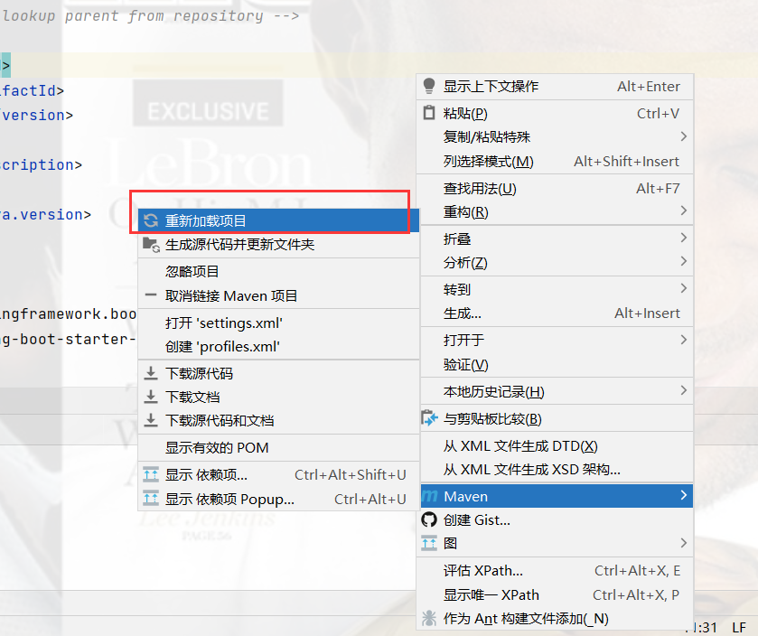
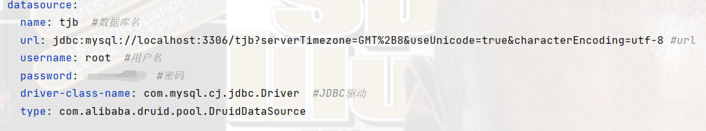
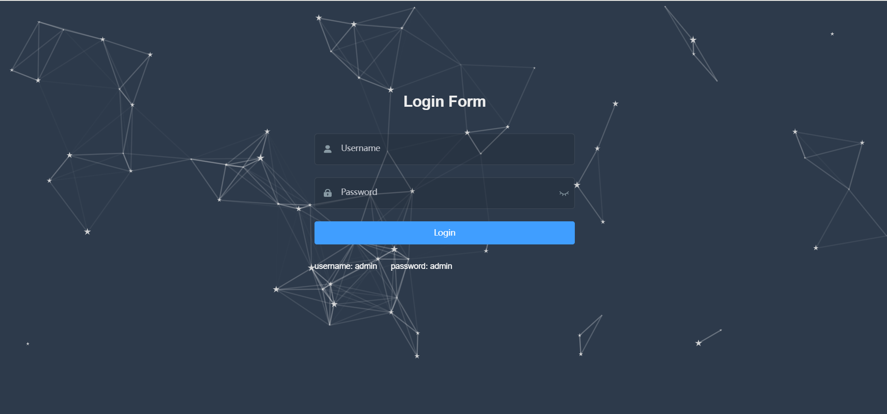
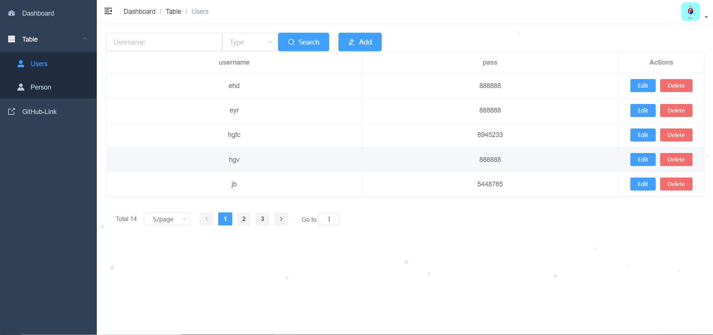

## 基于编程新技术实务实验的后台管理系统

在编程新技术实务实验基础上拔高了不少

采用前后端分离的方式，在网页上可进行对数据表的操作

#### 技术栈

前端主要采用的是 vue ，由于前端重复造轮子过多，这里采用了 [@PanJiaChen](https://github.com/PanJiaChen) 大佬的 [vue-admin-template](https://github.com/PanJiaChen/vue-admin-template) 框架，感谢 [@PanJiaChen](https://github.com/PanJiaChen) 大佬

在这个框架的基础上我增加了增删查改、操作弹出提示等功能

后端采用的是 springboot 框架，为前端提供需要的方法

#### 运行方法

先在前端项目中，输入以下指令安装必要依赖
```
npm install
```

然后使用 IDEA 打开后端项目，打开 pom.xml 文件安装依赖（如下图所示）



**使用前将 application.yml 文件里的数据库名，用户名，密码改成自己的**



运行后端项目

再输入以下指令运行前端
```sh
npm run dev
```
前提当然要先创建好数据表

创建 users 表：
```sql
CREATE TABLE IF NOT EXISTS users (
        username varchar(10) NOT NULL,
        pass varchar(8) NOT NULL,
        PRIMARY KEY (username));
```

创建 person 表：
```sql
CREATE TABLE IF NOT EXISTS person (
        username varchar(10) NOT NULL,
        name varchar(20) NOT NULL,
        age int,
        teleno char(11),
        PRIMARY KEY (username));
```

#### 效果展示





想知道具体怎么做的，欢迎参考我的[个人博客](https://tjbnbb.github.io/)